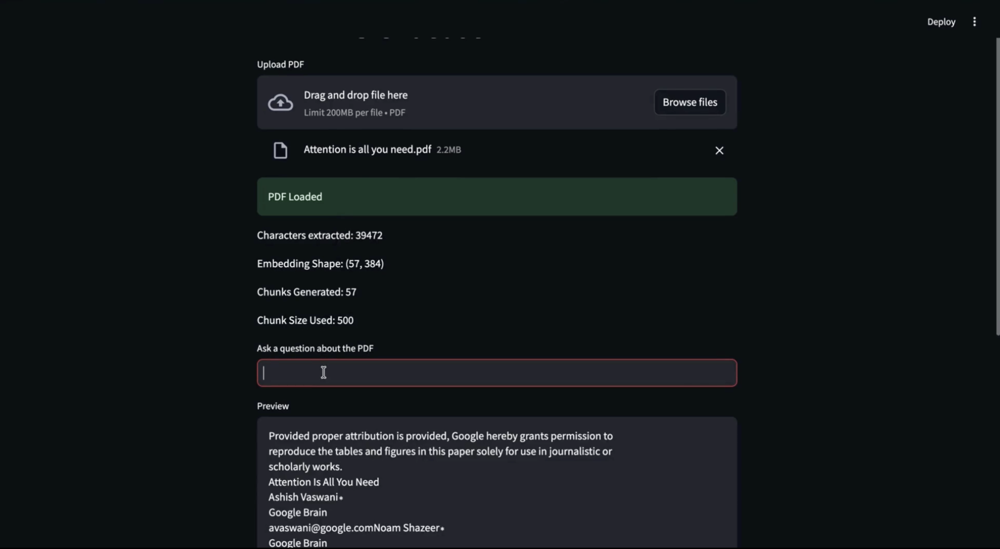
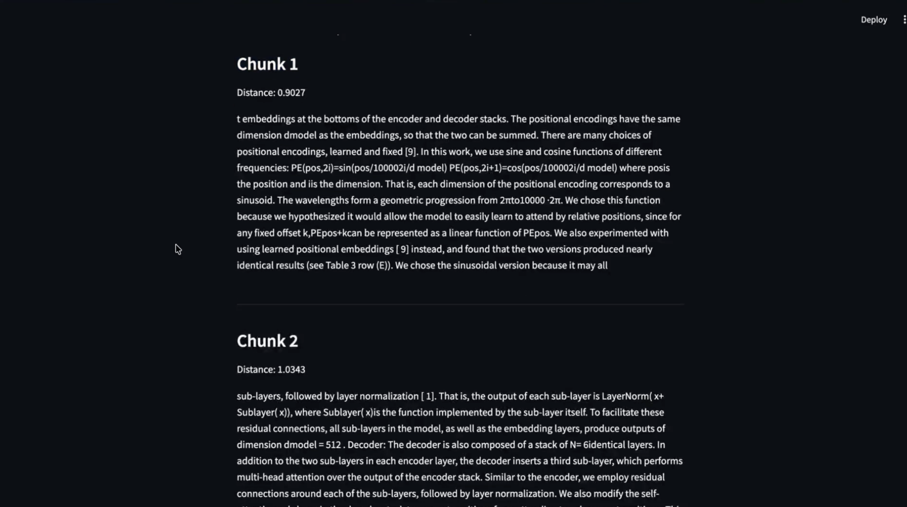
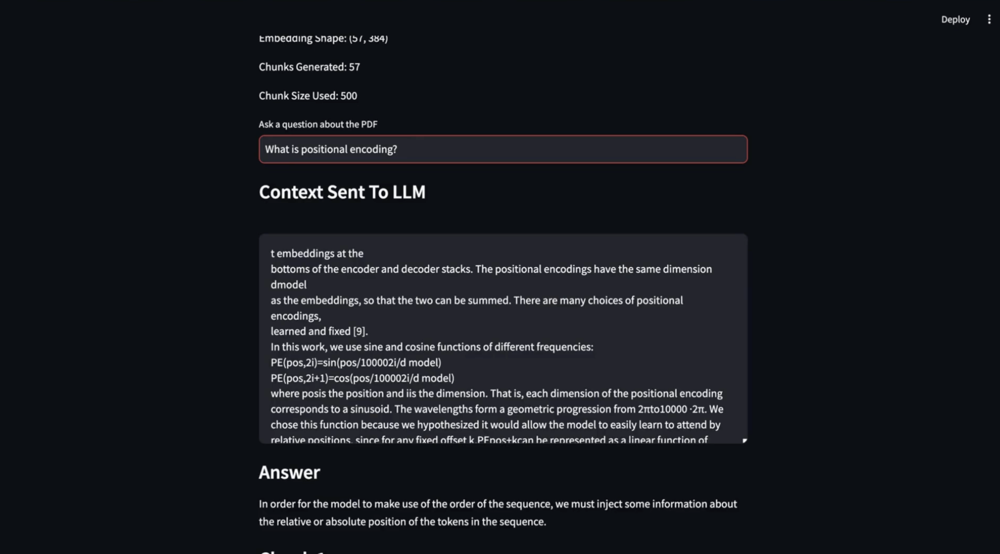

# PDF RAG Chatbot

A Retrieval-Augmented Generation (RAG) chatbot that enables users to upload PDF documents and ask natural language questions about their content. The system leverages semantic retrieval and large language models to generate context-aware answers from uploaded documents.

## Features

* PDF upload and text extraction
* Document chunking and preprocessing
* Semantic search using Sentence Transformers
* FAISS-based vector retrieval
* Context-aware answer generation with FLAN-T5-Large
* Interactive Streamlit interface
* Retrieval visualization with similarity scores

## Tech Stack

* Python
* Streamlit
* Sentence Transformers (all-MiniLM-L6-v2)
* FAISS
* Hugging Face Transformers
* FLAN-T5-Large
* PyPDF2

## Architecture

PDF → Text Extraction → Chunking → Embedding Generation → FAISS Index → Top-5 Retrieval → FLAN-T5 → Answer Generation

## Workflow

1. Upload a PDF document.
2. Extract and preprocess text using PyPDF2.
3. Generate embeddings using Sentence Transformers.
4. Store embeddings in a FAISS vector index.
5. Retrieve the Top-5 most relevant chunks for a user query.
6. Generate an answer using FLAN-T5-Large and the retrieved context.
7. Display the generated response along with retrieved passages and similarity scores.

## Project Highlights

* Built a complete Retrieval-Augmented Generation (RAG) pipeline for document question answering.
* Implemented 384-dimensional Sentence Transformer embeddings using all-MiniLM-L6-v2.
* Retrieved Top-5 relevant document chunks using FAISS similarity search.
* Integrated FLAN-T5-Large for context-aware question answering.
* Developed an interactive Streamlit-based user interface for PDF querying and retrieval visualization.

## Screenshots

### Upload PDF



### Retrieved Context



### Generated Answer



## Installation

```bash
git clone https://github.com/AdityaTamil/PDF_RAG_chatbot.git

cd PDF_RAG_chatbot

pip install -r requirements.txt
```

## Run

```bash
streamlit run app.py
```

## Applications

* Research Paper Question Answering
* Technical Documentation Search
* Academic PDF Exploration
* Knowledge Retrieval from Reports

## Future Enhancements

* Multi-document support
* Conversational memory
* Hybrid Retrieval (BM25 + Dense Retrieval)
* LLM API Integration (Gemini/OpenAI)
* Source Citation Highlighting
* Page-Level Answer Grounding

## Repository Structure

```text
PDF_RAG_chatbot/
│
├── app.py
├── requirements.txt
├── README.md
├── LICENSE
│
└── screenshots/
    ├── upload.png
    ├── retrieval.png
    └── answer.png
```
